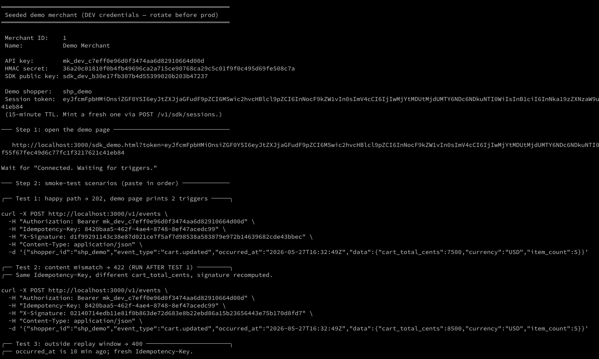
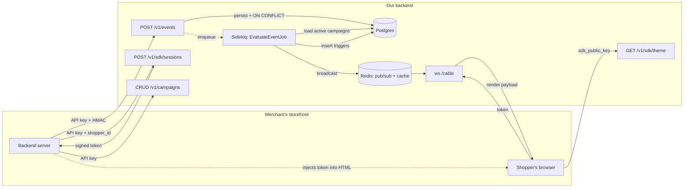

# Multi-tenant Trigger Engine

Backend for an embeddable widget platform. Storefronts POST shopper events; we evaluate them against per-merchant campaigns and broadcast render triggers to browser SDKs in near real-time. Built for the 99minds take-home assignment — Rails 8 API-only, Sidekiq, Action Cable.

The rubric weighting we targeted: **architectural judgment > correctness on the dangerous parts (HMAC / idempotency / tenancy / races) > API design > code quality > communication**.

---

## Quickstart

Pre-req: Docker + Docker Compose.

```bash
docker compose up --build
# In another shell:
docker compose exec web bin/rails db:seed
```

The seed prints dev credentials and **four ready-to-paste `curl` commands** (Tests 1–4) with pre-computed HMAC signatures, covering: the happy path, a content-mismatch replay, an outside-replay-window event, and an invalid payload. All four curls are valid for ~5 minutes from seed time (replay-window TTL) — re-seed if you wait longer. Open the printed `sdk_demo.html?token=...` URL in a browser, paste Test 1, and watch the demo page receive both triggers within ~1 second.

If anything's broken, the most likely suspects are documented in [§ Known limitations](#known-limitations).

---

## Configuration

The app reads secrets from environment variables. `.env.example` enumerates every variable; `docker-compose.yml` sets dev values inline so the Quickstart works with zero host setup.

### Local (non-Docker)

```bash
cp .env.example .env
# Then fill in the five required secrets with fresh random values:
openssl rand -hex 32        # run 5×; paste into the corresponding lines in .env
```

For the three `ACTIVE_RECORD_ENCRYPTION_*` keys you can also use Rails' generator, which emits them in the right format:

```bash
bin/rails db:encryption:init
```

### Production

- **Never commit production secrets.** The values in `docker-compose.yml` are explicitly DEV-ONLY and labeled as such.
- **Inject via a secrets manager** (AWS Secrets Manager, GCP Secret Manager, Vault, Doppler, fly.io secrets, Heroku config vars) at container/process start. Don't bake them into the image.
- **Rotation impact:**
  - `API_KEY_PEPPER` rotation invalidates every stored merchant API key. Requires a dual-read transition window — store the new pepper, compute *both* digests on lookup until all merchants have re-issued.
  - `SDK_JWT_SIGNING_KEY` rotation invalidates in-flight session tokens. Impact window is bounded by the 15-min TTL — safe to rotate without coordination if you can tolerate that.
  - `ACTIVE_RECORD_ENCRYPTION_PRIMARY_KEY` uses Rails' built-in dual-key rotation: set `config.active_record.encryption.previous = [{ ... }]` with the old key, deploy, re-encrypt rows in a background job, then remove the previous key.

The five secrets MUST be ≥ 32 bytes of entropy. `openssl rand -hex 32` produces 64 hex chars = 32 bytes; that's the floor.

---

## Local testing

### Happy-path smoke test

1. **Boot the stack:**

   ```bash
   docker compose up --build
   ```

   Wait for `web` to log `Listening on http://0.0.0.0:3000`.

2. **Seed the demo merchant + campaigns:**

   ```bash
   docker compose exec web bin/rails db:seed
   ```

   The output includes the API key, HMAC secret, SDK public key, a 15-min session token, and **four pre-computed `curl` commands** (Tests 1–4). Keep that terminal open.
   

3. **Open the demo page** (paste the URL from the seed output):

   ```
   http://localhost:3000/sdk_demo.html?token=<session-token>
   ```

   Status should turn green: `Connected. Waiting for triggers.`

4. **Paste Test 1 from the seed output into a second shell.** Expected:
   - Response: `202 Accepted` with `{"data":{"event_id":<n>,"status":"received"}}`.
   - Demo page prints **both** seeded campaigns' render payloads within ~1 second (a banner blob and a modal blob — the seeded event matches both `cart_total_cents >= 5000` and `item_count >= 5`).

### Verifying the dangerous parts

The seed output already includes Tests 1–4 as paste-and-go curls. Run them in order:

| Test | What it exercises | Expected response |
|---|---|---|
| Test 1 (seed) | Happy path | `202` + demo page lights up with 2 triggers |
| Replay Test 1 as-is | Idempotency — same key + same body | `202` with the **same** `event_id`; demo page silent (RETURNING gate) |
| Test 2 (seed) | Content mismatch — same Idempotency-Key, different `cart_total_cents` | `422 idempotency.content_mismatch` |
| Test 3 (seed) | Replay window — `occurred_at` is 10 min ago | `400 event.outside_replay_window` |
| Test 4 (seed) | Invalid payload — `data` is a string, not a hash | `400 event.invalid_payload` |

Additional manual tweaks worth verifying:

| Tweak | Expected response |
|---|---|
| Change ONLY `Idempotency-Key` (leave signature unchanged) | `401 auth.invalid_signature` — proves the key is in the HMAC payload |
| Flip one hex char in `X-Signature` | `401 auth.invalid_signature` |
| Drop the `Idempotency-Key` header | `400 event.idempotency_key_required` |
| Body is not valid JSON (e.g. `-d 'not-json'`) | `400 request.invalid_json` |
| Demo page opened with `?token=garbage` | "Disconnected." (token rejected at WebSocket upgrade) |
| Demo page opened with no `?token=` | "Missing ?token=... in URL." |

For cross-merchant isolation, seed a second merchant from the Rails console and confirm merchant A's demo page never sees merchant B's broadcasts. The code-level guarantee chain is documented under [§ Multi-tenant safety](#multi-tenant-safety).

### Linter + security scans

```bash
docker compose exec web bin/rubocop                # style (rubocop-rails-omakase)
docker compose exec web bin/brakeman --no-pager    # static security analysis
docker compose exec web bin/bundler-audit          # known-vulnerable gem check
```

All three are wired into GitHub Actions on push (no service containers needed — see `.github/workflows/ci.yml`).

### Tests

```bash
# One-time: create and migrate the test database (docker-compose only sets up development).
docker compose exec web bin/rails db:test:prepare

# Run the suite (rails_helper.rb forces RAILS_ENV=test regardless of container env).
docker compose exec web bundle exec rspec
```

---

## Architecture



Four moving parts:

1. **Ingest** (`POST /v1/events`) — Bearer + HMAC verify on raw body, single-INSERT idempotent persistence (`ON CONFLICT DO NOTHING RETURNING id`), enqueues `EvaluateEventJob`, returns `202 Accepted` in milliseconds.
2. **Evaluate** (Sidekiq) — loads active campaigns for `(merchant_id, event_type)` (partial index, hot path), runs a pure-Ruby condition evaluator, inserts matching `Trigger` rows with the same `ON CONFLICT` gate.
3. **Dispatch** (Action Cable + Redis adapter) — broadcasts the campaign's `render` blob on `merchant:#{merchant_id}:shopper:#{shopper_id}`. At-most-once: only when the trigger INSERT returned a new row.
4. **SDK** (browser) — authenticates the WebSocket upgrade with a 15-min `MessageVerifier`-signed token minted by the merchant's backend. Subscribes to the per-shopper channel.

---

## Endpoints

| Method | Path | Auth | Purpose |
|---|---|---|---|
| `POST` | `/v1/events` | `Bearer <api_key>` + `X-Signature` + `Idempotency-Key` | Ingest a storefront event. |
| `GET` | `/v1/campaigns` | `Bearer <api_key>` | List campaigns (most recent first, max 100). |
| `POST` | `/v1/campaigns` | `Bearer <api_key>` | Create a campaign. |
| `GET` | `/v1/campaigns/:id` | `Bearer <api_key>` | Show one. |
| `PATCH` | `/v1/campaigns/:id` | `Bearer <api_key>` | Update (pause / change conditions / etc.). |
| `DELETE` | `/v1/campaigns/:id` | `Bearer <api_key>` | Delete. |
| `GET` | `/v1/sdk/theme` | `Bearer <sdk_public_key>` | Theme blob for the browser SDK (cached, ETag). |
| `POST` | `/v1/sdk/sessions` | `Bearer <api_key>` | Mint a 15-min session token for a shopper. |
| `WS` | `/cable?token=...` | Signed session token | Real-time trigger delivery. |

See [`requests.http`](./requests.http) for ready-to-paste examples. Error envelope is uniform: `{ "error": { "code": "...", "message": "..." } }`.

---

## Design decisions

The four decisions where we made non-obvious calls. Lighter-weight ones (DB choice, Ruby version, tenancy gem, etc.) are tagged inline with rationale; ask for depth on any.

### 1. HMAC signs `Idempotency-Key + ":" + body`, not just body

**The brief shows** `X-Signature: <hmac-sha256 of body with merchant_secret>`. We sign `Idempotency-Key + ":" + body` instead.

**Why.** An attacker who captures one legitimate request can keep the body unchanged (signature stays valid), keep `occurred_at` unchanged (replay-window check passes for up to 5 minutes), but **swap the Idempotency-Key for a fresh UUID**. Our `(merchant_id, idempotency_key)` dedup sees a "new" key and processes the event again — extra triggers fire per replay attempt. Body-only HMAC + partial idempotency index combine to create the hole.

The industry fix is to bind the dedup token to the signature. Stripe signs `t.body`; Standard Webhooks signs `id.timestamp.body`. We include the Idempotency-Key — minimal contract deviation, closes the hole.

### 2. At-most-once trigger delivery via `RETURNING id` gate

**The pattern.** `Trigger.insert_all([...], unique_by: :index_triggers_on_merchant_event_campaign, returning: [:id])` returns one row on a new insert, zero rows on conflict. `Triggers::Dispatch.call(...)` fires **only** when `result.rows.first.present?`.

**Why at-most-once and not at-least-once.** Action Cable is fire-and-forget — no SDK ack. "At-least-once" without an ack reduces to "broadcast multiple times and hope," which the SDK has no way to de-dup. For marketing-style triggers (banners, modals), duplicate renders flash UI, restart animations, and look broken. Lost triggers are quieter failures than duplicates.

**Sidekiq retry case.** Insert succeeds → broadcast raises (Redis blip) → Sidekiq retries → insert hits conflict → RETURNING is empty → skip silently. Trigger row exists in the DB (auditable, replayable manually); the broadcast didn't land. This is the documented failure mode.

**Production migration.** Add an ack channel from SDK back to server; resurrect `triggers.dispatched_at`; broadcast only when null; mark on ack. Add `delivered_at`. Build a replay tool for `dispatched_at IS NOT NULL AND delivered_at IS NULL AND created_at < N.minutes.ago`. Real product change, not just implementation detail.

### 3. SDK channel auth: signed session token, not publishable key

**The trap.** The `sdk_public_key` is rendered into every shopper's HTML by design — the SDK uses it to fetch the theme. If we let the browser use that same key to authenticate the Action Cable connection, **any visitor to any storefront can subscribe to any other shopper's channel** by reading the public key from HTML and guessing/harvesting shopper IDs. Render triggers can contain personalized content; cross-shopper leakage in a security-graded review is the worst failure mode.

**Our flow.** `POST /v1/sdk/sessions` is authenticated by the merchant's **secret** API key (server-to-server only). The merchant's backend mints a 15-min `ActiveSupport::MessageVerifier`-signed token wrapping `{merchant_id, shopper_id}`. The token is rendered into the storefront's HTML server-side; the browser passes it to `ws://.../cable?token=...`; `ApplicationCable::Connection#connect` verifies and sets identifiers. Cross-shopper subscription now requires the merchant's secret key — brute-forcing 256-bit MessageVerifier-signed tokens is infeasible.

**What we give up.** Tokens travel in URL params during the WebSocket upgrade — they can land in proxy access logs and referer headers. Mitigated by the 15-min TTL. Production migration: `Sec-WebSocket-Protocol` subprotocol header (browsers can't set arbitrary headers on WebSockets, but the subprotocol slot is set-able) or a `Secure; HttpOnly; SameSite=Strict` cookie scoped to a shared domain.

### 4. Action Cable + Redis adapter (URL-param token)

Action Cable was chosen over SSE and external services for this take-home:

- **Vs. SSE.** SSE is simpler to debug but Puma's thread model hurts: each long-lived SSE response holds a Puma thread for hours. With default 5-thread Puma, only 5 concurrent shoppers per worker. Action Cable's EventMachine reactor handles more concurrent connections per worker.
- **Vs. Pusher/Anycable/Centrifugo.** External service ops complexity not justified at take-home scope. Production migration: one-line swap in `config/cable.yml` (`adapter: anycable`).
- **Token in URL param.** Browsers cannot set headers on `new WebSocket(...)`. Alternatives are subprotocol-header trick or domain-scoped cookies — both have deployment-topology coupling we don't want for a portable demo.

### Other choices, briefly

- **Postgres** — JSONB, partial indexes, `ON CONFLICT DO NOTHING RETURNING`, advisory locks for future race-sensitive paths. MySQL would have worked.
- **`acts_as_tenant` gem, not custom default_scope** — battle-tested, includes a Sidekiq middleware that threads tenant via job args. `default_scope` has well-known footguns (association behavior, `unscoped` escape hatch, test friction).
- **SHA256+pepper for API keys, not bcrypt** — API keys are 256+ bits of random; bcrypt's tunable work factor defends *low-entropy passwords*. Bcrypt would burn the entire ingest p99 budget per webhook. Industry-standard for high-entropy tokens (GitHub, Stripe, AWS).
- **Rails 8 Active Record Encryption** for `merchants.hmac_secret` at rest. AES-GCM via env-configured key.
- **`ActiveSupport::MessageVerifier`** for SDK session tokens, not the `jwt` gem — built-in, faster, zero dependency surface. JWT vocabulary doesn't add value when only our server signs and verifies.
- **`status` field omitted; `active` boolean kept** — simpler. Production would use a status enum (active/paused/archived/draft) for lifecycle.
- **Bigint primary keys**, not UUIDs — simpler joins, no extension needed, IDs aren't externally exposed except as `event_id` in 202 responses.

---

## Multi-tenant safety

Cross-merchant data leakage is the worst possible bug per the brief. Six layers, any one of which would block a leak; they compose.

1. **Token mint requires the merchant's secret API key.** `POST /v1/sdk/sessions` is gated by `AuthenticateMerchant` (SHA256-pepper digest lookup). 401 if missing or wrong.
2. **`merchant_id` in tokens is server-set, never client-provided.** `Sdk::SessionToken.encode(merchant_id: ActsAsTenant.current_tenant.id, ...)` reads from the authenticated current_tenant, not request params.
3. **Token signature is cryptographic.** `ActiveSupport::MessageVerifier` HMAC-signs the claims. Tampering invalidates.
4. **`Connection#connect` rejects on bad/expired/missing token.** Three rejection paths return 401 before any Channel is instantiated.
5. **Channels read `merchant_id` from the connection identifier**, set in step 4 from the verified token. `TriggersChannel#subscribed` does NOT read from `params`, `Current.merchant`, or the subscribe message.
6. **Broadcast keys are tenant-namespaced.** `merchant:#{merchant_id}:shopper:#{shopper_id}` — distinct stream key per merchant, distinct Redis pubsub channel.

Plus `acts_as_tenant.require_tenant = true` raises if any tenant-scoped query (Event, Campaign, Trigger) runs without `current_tenant`. Plus a six-grep audit ritual we ran on every chunk that touches merchant data (cache keys, channel keys, Sidekiq args, channel actions). Plus `merchant_id` is passed *explicitly* to every Sidekiq job and `Trigger.insert_all` call — belt-and-suspenders alongside the gem.

The single point of failure is `ENV['SDK_JWT_SIGNING_KEY']` — same single point of failure as any HMAC-signed token system. The committed dev value is documented as DEV-ONLY in `docker-compose.yml`.

---

## Concurrency model and known limitations

### Same-shopper event ordering

Two events for the same shopper arriving within milliseconds can be picked up by different Sidekiq workers and **evaluated out of `occurred_at` order**. For stateful campaigns (e.g., "fire on the *third* order placed by this shopper"), this matters. We don't ship stateful evaluation in v1, so the failure mode is benign today, but it's a real production concern.

Two production-grade fixes, neither shipped:
- **Per-shopper Sidekiq routing** via consistent-hash actor pattern (Sidekiq Pro has this; can be hand-rolled with `sidekiq-throttled` or queue-per-shopper).
- **Postgres advisory locks** keyed on `(merchant_id, shopper_id)` around the evaluator block — serializes per-shopper, leaves cross-shopper concurrency intact.

We picked neither for v1 because (a) no stateful campaigns ship, (b) both add meaningful operational surface, (c) the brief flags this as a bonus item.

### Per-merchant worker fairness

A single Sidekiq queue means a **flooding merchant can saturate workers and starve others**. The brief explicitly calls this out as a multi-tenancy concern.

Two production fixes, neither shipped:
- **Per-merchant queues** via Sidekiq's routing (`queue: "events_#{merchant_id}"` with weighted dispatch).
- **`sidekiq-throttled`** for per-merchant rate caps (admission control).

Per-merchant queues are the right answer at scale; we documented as Phase 3 polish.

### At-most-once trigger semantics (recap)

Already detailed under [Design decisions / 2](#2-at-most-once-trigger-delivery-via-returning-id-gate). Briefly: the `ON CONFLICT RETURNING` gate prevents duplicate broadcasts on Sidekiq retry, at the cost of rare lost broadcasts when broadcast fails after a successful insert.

### Other known limitations

- **No max body size at Rack level** for chunked transfer encoding. The controller-level check on `Content-Length` is bypassable by chunked clients. Document; production-fix is Puma's `max_request_size` or a `Rack::ContentLength` middleware.
- **`FieldPath` doesn't support array indexing** (`data.items.0.price`). Real event payloads often have arrays; v1 traversal is hash-only by design. Extensible.
- **No CI for RSpec** — only `bundle exec rubocop` + `brakeman` + `bundler-audit`. Setting up Postgres + Redis services in GHA was a YAML rabbit hole we explicitly declined. Tests run locally.
- **Pagination on `/v1/campaigns`** — hardcoded `limit(100)` with no cursor. Fine for ≤100 campaigns/tenant; document and add `?cursor=` when scale demands.
- **Shopper identity is merchant-asserted.** No `Shopper` model — the merchant's backend tells us which shopper to mint a token for. Standard B2B-SaaS trust boundary (Stripe Connect, Auth0, Cognito all do this).
- **`@rails/actioncable@8.1.300` is vendored** at `public/actioncable.js`. No CDN dependency for the demo.

---

## What we'd build next

Listed in roughly the order we'd implement.

### Phase 2 (bonuses we'd implement next)

- **Frequency caps** (`"don't show this campaign to the same shopper more than once a day"`). State: Redis `INCR` with TTL on `freq:campaign:#{id}:shopper:#{shopper_id}:#{date}` — atomic, expires automatically. Integration: `EvaluateEventJob` checks `INCR < limit` before inserting the trigger; on race, the `INCR` returning > limit causes a silent skip. Schema: one column `campaigns.frequency_cap` (JSON: `{per: "day", limit: 1}`).
- **Replay endpoint.** `POST /v1/events/:event_id/replay` — re-runs `EvaluateEventJob.perform_async` on a historical event. Semantics: re-evaluates against **current** campaigns (most useful for debugging "did this event match?"). Auth: merchant secret key only. Trigger inserts still go through the at-most-once gate, so replay never double-fires.
- **Rate limiting.** `Rack::Attack` with a sliding-window throttle keyed on `merchant_id`. Limits: ~100 events/sec/merchant by default; merchant-configurable later. Response on throttle: `429 Too Many Requests` with `Retry-After` header.
- **Observability hooks.** `lograge` for structured logs (JSON output), `ActiveSupport::Notifications` subscribers for: `event.received`, `event.deduplicated`, `campaign.matched`, `trigger.dispatched`. Counters + histograms ready to hook into Prometheus / StatsD / Datadog.
- **Test suite.** Request specs for every endpoint, model specs for tenant scoping (with `with_tenant` block tests), one integration spec for the race condition (two threads, same idempotency key, assert single trigger row).

### Phase 3 (production polish)

- Per-merchant Sidekiq queues with weighted dispatch (above)
- Postgres advisory locks on per-shopper evaluation (above)
- Postgres Row-Level Security as defense-in-depth in addition to `acts_as_tenant`
- SDK ack channel → resurrect `dispatched_at`/`delivered_at` for at-least-once semantics
- WebSocket subprotocol-header / cookie-based channel auth (URL-param replacement)
- EXPLAIN snippets in repo for the two highest-traffic queries
- Trigger DLQ + manual replay tooling

---

## What we'd do differently with more time

- **Stateful campaign evaluation.** "Third order placed" requires an aggregation layer that doesn't fit a 10h scope. Real product features (lifetime spend, abandoned cart count, last-purchase recency) need this.
- **A `Shopper` model and a real session/identity story.** Currently shopper identity is merchant-asserted; for products that talk to shoppers across merchants (loyalty federation, cross-store cart), this needs a first-class identity model.
- **Operator extensibility — `negate` flag instead of `neq`/`not_in`.** LaunchDarkly's pattern. We dropped `neq` and `in` to match the brief literally; `negate: true` on a condition would let us add operators sparingly and compose them.
- **`status` enum vs. `active` boolean** on campaigns. Future lifecycle (paused, draft, archived) wants this.
- **Stripe-style opaque prefixed IDs** (`cmp_xxx`, `evt_xxx`). Currently bigint exposed as int. Easy refactor; high signal in code review.
- **`details:` array in error envelope.** Currently field-level validation errors are concatenated with `; ` in `message`. Hostile for clients trying to render field-specific UI.

---

## Development reference

```
app/
├── channels/                     # Action Cable
│   ├── application_cable/{connection,channel}.rb
│   └── triggers_channel.rb
├── controllers/
│   ├── application_controller.rb # rescue_from + render_api_error envelope
│   ├── concerns/authenticate_merchant.rb
│   └── api/v1/{events,campaigns,sdk/{themes,sessions}}_controller.rb
├── domain/condition_evaluator.rb # pure-Ruby, allowlisted dotted-path resolver
├── errors/api_error.rb           # status + code + message; rescued at base controller
├── jobs/evaluate_event_job.rb    # at-most-once gate
├── lib/sdk/session_token.rb      # MessageVerifier wrapper
├── models/{merchant,event,campaign,trigger}.rb
└── services/
    ├── authentication/verify_hmac.rb
    ├── events/ingest.rb          # parse → window check → INSERT ON CONFLICT
    └── triggers/dispatch.rb      # ActionCable.server.broadcast
```

```
config/
├── initializers/
│   ├── acts_as_tenant.rb             # require_tenant=true + Sidekiq middleware
│   └── active_record_encryption.rb  # bridges ACTIVE_RECORD_ENCRYPTION_* env vars to Rails config
└── ...
```

Common commands:

```bash
docker compose up --build              # boot everything
docker compose exec web bin/rails db:seed
docker compose exec web bin/rails console
docker compose exec web bundle exec rubocop
docker compose exec web bin/rails db:test:prepare   # one-time test DB setup
docker compose exec web bundle exec rspec            # run specs
docker compose down -v                 # nuke volumes (Postgres, Redis, bundle cache)
```

The Rails 8 production `Dockerfile` is kept at repo root unchanged as a deployment reference; local dev uses `Dockerfile.dev`. The trio of `config.action_cable.allowed_request_origins`, `config.action_cable.url`, and a shared `REDIS_URL` across containers is what makes the demo page connect — see `config/environments/development.rb` and `docker-compose.yml`.
