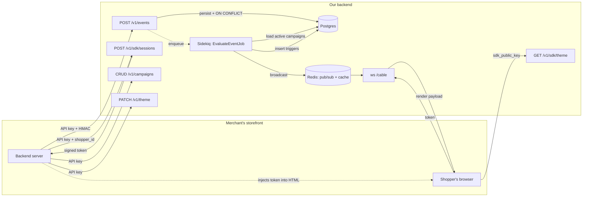

# Multi-tenant Trigger Engine

Backend for an embeddable widget platform. Storefronts POST shopper events; we evaluate them against per-merchant campaigns and broadcast render triggers to browser SDKs in near real-time. Rails 8 API-only, Sidekiq, Action Cable.

Rubric weighting targeted: **architectural judgment > correctness on the dangerous parts (HMAC / idempotency / tenancy / races) > API design > code quality > communication**.

---

## Quickstart

Pre-req: Docker + Docker Compose.

```bash
docker compose up --build
# In another shell:
docker compose exec web bin/rails db:seed
```

The seed prints dev credentials and **four ready-to-paste curls** (Tests 1–4) covering happy path, content-mismatch replay, outside-replay-window, and invalid payload. All valid for ~5 minutes (replay-window TTL). Open the printed `sdk_demo.html?token=...` URL, paste Test 1, watch the demo page receive both triggers within ~1 second.

---

## Configuration

`.env.example` enumerates every required ENV var. `docker-compose.yml` sets DEV values inline (committed, labeled DEV-ONLY) so Quickstart works with zero host setup.

Non-Docker: `cp .env.example .env`, then `openssl rand -hex 32` ×5 (or `bin/rails db:encryption:init` for the AR encryption trio).

**Rotation impact** (production):
- `API_KEY_PEPPER` → invalidates every merchant API key; needs dual-read transition.
- `SDK_JWT_SIGNING_KEY` → invalidates in-flight session tokens; bounded by 15-min TTL.
- `ACTIVE_RECORD_ENCRYPTION_PRIMARY_KEY` → use Rails' built-in `previous` config for dual-key rotation.

---

## Local testing

### Smoke test

1. `docker compose up --build` → wait for `Listening on http://0.0.0.0:3000`.
2. `docker compose exec web bin/rails db:seed` → prints credentials + 4 curls.
3. Open the printed `sdk_demo.html?token=<token>` URL. Status turns green: "Connected. Waiting for triggers."
4. Paste Test 1 in another shell → `202`, demo page prints both seeded triggers within ~1s.

### Verifying the dangerous parts

| Test | Exercise | Expected |
|---|---|---|
| Test 1 (seed) | Happy path | `202` + 2 triggers on demo page |
| Replay Test 1 | Idempotency — same key + body | `202` same `event_id`; page silent (RETURNING gate) |
| Test 2 (seed) | Same Idempotency-Key, different body | `422 idempotency.content_mismatch` |
| Test 3 (seed) | `occurred_at` 10 min ago | `400 event.outside_replay_window` |
| Test 4 (seed) | `data` is a string, not a hash | `400 event.invalid_payload` |

Manual tweaks worth checking:

| Tweak | Expected |
|---|---|
| Swap Idempotency-Key (keep signature) | `401 auth.invalid_signature` — proves key is in HMAC payload |
| Flip a hex char in `X-Signature` | `401 auth.invalid_signature` |
| Drop `Idempotency-Key` header | `400 event.idempotency_key_required` |
| Body is not valid JSON | `400 request.invalid_json` |
| Demo page with `?token=garbage` | "Disconnected." |

### Linter + security scans

```bash
docker compose exec web bin/rubocop
docker compose exec web bin/brakeman --no-pager
docker compose exec web bin/bundler-audit
```

All wired into GitHub Actions on push.

### Tests

```bash
docker compose run --rm test bin/rails db:test:prepare  # one-time
docker compose run --rm test bundle exec rspec
```

The `test` service in `docker-compose.yml` inherits the shared env block and overrides `RAILS_ENV: test`. Specs cover request-level happy paths, auth/HMAC/idempotency failures, cross-tenant 404 isolation, and theme update for every endpoint.

---

## Architecture



Four moving parts:

1. **Ingest** (`POST /v1/events`) — Bearer + HMAC verify on raw body, single-INSERT idempotent persistence (`ON CONFLICT DO NOTHING RETURNING id`), enqueues `EvaluateEventJob`, returns `202` in milliseconds.
2. **Evaluate** (Sidekiq) — loads active campaigns for `(merchant_id, event_type)` (partial index), runs the pure-Ruby condition evaluator, inserts `Trigger` rows with the same `ON CONFLICT` gate.
3. **Dispatch** (Action Cable + Redis adapter) — broadcasts on `merchant:#{merchant_id}:shopper:#{shopper_id}`. At-most-once: only when the trigger INSERT returned a new row.
4. **SDK** (browser) — authenticates the WebSocket upgrade with a 15-min `MessageVerifier`-signed token minted by the merchant's backend.

---

## Endpoints

| Method | Path | Auth | Purpose |
|---|---|---|---|
| `POST` | `/v1/events` | `Bearer <api_key>` + `X-Signature` + `Idempotency-Key` | Ingest a storefront event. |
| `GET / POST / PATCH / DELETE` | `/v1/campaigns[/:id]` | `Bearer <api_key>` | Campaign CRUD. |
| `PATCH` | `/v1/theme` | `Bearer <api_key>` | Update merchant theme; bumps `theme_version` (busts SDK cache). |
| `GET` | `/v1/sdk/theme` | `Bearer <sdk_public_key>` | Theme blob for the browser SDK (cached, ETag). |
| `POST` | `/v1/sdk/sessions` | `Bearer <api_key>` | Mint a 15-min session token for a shopper. |
| `WS` | `/cable?token=...` | Signed session token | Real-time trigger delivery. |

Error envelope: `{ "error": { "code": "...", "message": "..." } }`. See `requests.http` for examples.

---

## Design decisions

Three calls worth flagging.

### 1. HMAC signs `Idempotency-Key + ":" + body`, not just body

The brief shows body-only HMAC. We extend the signed payload to include the Idempotency-Key. **Reason:** an attacker who captures one legitimate request can swap the Idempotency-Key for a fresh UUID — body-only signature stays valid, the dedup index sees a "new" key, the event re-fires triggers. Industry fix (Stripe signs `t.body`, Standard Webhooks signs `id.timestamp.body`) — same idea, minimally applied.

### 2. At-most-once trigger via `RETURNING id` gate

`Trigger.insert_all(...)` returns one row on a new insert, zero on conflict. Dispatch fires only when `result.rows.first.present?`. On Sidekiq retry the conflict path is silent — no duplicate broadcasts. Trade-off: rare lost broadcasts when broadcast fails after a successful insert. For marketing triggers (banners, modals) duplicate renders flash UI; we picked lost-over-duplicate. Production fix would resurrect `triggers.dispatched_at` + SDK ack for at-least-once.

### 3. SDK channel auth: signed session token, not publishable key

The `sdk_public_key` is rendered into every shopper's HTML — using it for channel auth would let any visitor subscribe to any shopper's stream. Instead, the merchant's backend mints a 15-min `MessageVerifier`-signed token via `POST /v1/sdk/sessions` (server-to-server, secret key). Token travels in the WebSocket upgrade URL — visible to proxy logs / referers, mitigated by short TTL. Production fix: `Sec-WebSocket-Protocol` subprotocol-header trick or a domain-scoped cookie.

### Other choices, briefly

- **Postgres** for JSONB + partial indexes + `ON CONFLICT DO NOTHING RETURNING`.
- **`acts_as_tenant`** over custom `default_scope` — battle-tested, Sidekiq middleware threads tenant via job args.
- **SHA256+pepper for API keys**, not bcrypt — API keys are 256-bit random; bcrypt defends low-entropy passwords.
- **Rails 8 AR Encryption** for `merchants.hmac_secret` at rest.
- **`MessageVerifier`** for session tokens, not the `jwt` gem — built-in, faster, zero deps.
- **Action Cable + Redis** over SSE (Puma thread cost) / Pusher (ops complexity).

---

## Multi-tenant safety

Cross-merchant data leakage is the worst possible bug per the brief. Six layers, any one would block a leak:

1. **Token mint requires merchant secret API key** — `POST /v1/sdk/sessions` is gated by `AuthenticateMerchant`.
2. **`merchant_id` in tokens is server-set** — read from `ActsAsTenant.current_tenant.id`, never request params.
3. **Token signature is cryptographic** — `MessageVerifier` HMAC-signs claims.
4. **`Connection#connect` rejects bad/expired/missing tokens** before any channel is instantiated.
5. **Channels read `merchant_id` from the connection identifier**, never params or `Current.merchant`.
6. **Broadcast keys are tenant-namespaced**: `merchant:#{merchant_id}:shopper:#{shopper_id}`.

Plus `acts_as_tenant.require_tenant = true` raises on any tenant-scoped query without `current_tenant`. Plus `merchant_id` is passed *explicitly* to every Sidekiq job and `insert_all` call. Theme cache key includes `merchant_id` + `theme_version`.

---

## What's been built

- **Webhook ingestion** — Bearer + HMAC auth, single-INSERT idempotency, content-hash mismatch detection, replay-window enforcement.
- **Campaign CRUD** with JSON condition trees (`eq`, `gt`, `gte`, `lt`, `lte`, `exists`) — server-side schema validated.
- **Theme update** (`PATCH /v1/theme`) bumps `theme_version` to bust the per-merchant SDK cache.
- **Async evaluation** (`EvaluateEventJob`) with at-most-once trigger dispatch via `ON CONFLICT RETURNING`.
- **Real-time delivery** over Action Cable on tenant-namespaced channels.
- **SDK endpoints** — theme read (SDK public key, ETag-cached) + session token mint (merchant secret, 15-min TTL).
- **Multi-tenant isolation** via `acts_as_tenant` + connection-identifier-sourced merchant_id in channels.
- **Request specs** for every endpoint — happy paths, auth/HMAC/idempotency failures, cross-tenant 404 isolation, theme update.
- **Demo HTML** (`public/sdk_demo.html`) that connects to the cable channel and prints incoming triggers.
- **CI** — GitHub Actions runs RuboCop + Brakeman + bundler-audit on push.

---

## Would do if I had more time

**Correctness:**
- **Dangerous-parts specs** — tenant leak at the job layer (`with_tenant` mismatch returns empty), concurrent idempotency double-fire test, evaluator unit tests.
- **Same-shopper event ordering** — two events for the same shopper can be evaluated out of `occurred_at` order. Fixes: per-shopper Sidekiq routing via consistent-hash, or Postgres advisory locks on `(merchant_id, shopper_id)`.
- **Stateful campaign evaluation** ("third order placed") — needs an aggregation layer.

**Operability:**
- **Per-merchant worker fairness** — single Sidekiq queue means a flooding merchant can starve others. Per-merchant queues with weighted dispatch (or `sidekiq-throttled` for admission control).
- **Rate limiting** — `Rack::Attack` sliding-window throttle per `merchant_id`, `429` + `Retry-After`.
- **Observability** — `lograge` JSON logs + `ActiveSupport::Notifications` subscribers for `event.received`, `campaign.matched`, `trigger.dispatched`.
- **Frequency caps** — Redis `INCR` with TTL key `freq:campaign:#{id}:shopper:#{shopper_id}:#{date}`.
- **Replay endpoint** — `POST /v1/events/:id/replay` re-runs evaluation against current campaigns.

**Hardening:**
- **SDK ack channel** → resurrect `triggers.dispatched_at` + `delivered_at` for at-least-once.
- **WebSocket subprotocol-header or cookie auth** to replace URL-param token.
- **Postgres Row-Level Security** as defense-in-depth alongside `acts_as_tenant`.
- **Trigger DLQ + manual replay tooling**.

**API polish:**
- **Stripe-style opaque prefixed IDs** (`cmp_xxx`, `evt_xxx`).
- **`details:` array in error envelope** for field-level validation errors.
- **Cursor pagination on `/v1/campaigns`** (current `limit(100)` hardcoded).
- **`status` enum** vs `active` boolean (supports paused/draft/archived).
- **Sparse PATCH on campaigns** — current controller passes all fields; sparse `{ active: false }` would fail validation.
- **Array indexing in `FieldPath`** (`data.items.0.price`).
- **No Rack-level max body size** for chunked transfer — controller-level check is bypassable.

---

## Development reference

```
app/
├── channels/                          # ApplicationCable + TriggersChannel
├── controllers/
│   ├── application_controller.rb      # rescue_from + uniform error envelope
│   ├── concerns/authenticate_merchant.rb
│   └── api/v1/{events,campaigns,themes,sdk/{themes,sessions}}_controller.rb
├── domain/condition_evaluator.rb      # pure-Ruby, allowlisted dotted-path resolver
├── jobs/evaluate_event_job.rb         # at-most-once gate
├── lib/sdk/session_token.rb           # MessageVerifier wrapper
├── models/{merchant,event,campaign,trigger}.rb
└── services/
    ├── authentication/verify_hmac.rb
    ├── events/ingest.rb               # parse → window check → INSERT ON CONFLICT
    └── triggers/dispatch.rb           # ActionCable.server.broadcast

config/initializers/
├── acts_as_tenant.rb                  # require_tenant=true + Sidekiq middleware
└── active_record_encryption.rb        # bridges AR encryption env vars to Rails config
```

```bash
docker compose up --build                                # boot everything
docker compose exec web bin/rails db:seed                # seed demo merchant + curls
docker compose exec web bin/rails console
docker compose exec web bin/rubocop
docker compose run --rm test bin/rails db:test:prepare   # one-time test DB setup
docker compose run --rm test bundle exec rspec
docker compose down -v                                   # nuke volumes
```
